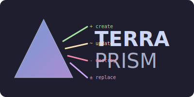

<p align="center">
  
</p>

<p align="center">
  <strong>A beautiful terminal UI for viewing Terraform and OpenTofu plans</strong>
</p>

<p align="center">
  <a href="https://github.com/CaptShanks/terraprism/actions/workflows/ci.yml"></a>
  <a href="https://github.com/CaptShanks/terraprism/releases"></a>
  <a href="https://go.dev/"></a>
  <a href="https://goreportcard.com/report/github.com/CaptShanks/terraprism"></a>
  <a href="LICENSE"></a>
</p>

<p align="center">
  Collapsible resources • Syntax-highlighted HCL • Vim-style navigation • Auto light/dark mode
</p>

---

<!--  -->

## Features

- 🎨 **Syntax-highlighted HCL** - Full color-coded display of your plan
- 📁 **Collapsible resources** - Expand/collapse individual resources or all at once
- 🔍 **Search** - Find resources by name, type, or address
- ⌨️ **Vim-style navigation** - j/k/gg/G/d/u and more
- 🌗 **Auto light/dark mode** - Detects your terminal background
- 📋 **Format support** - Works with Terraform 0.11+ and OpenTofu
- 🎯 **Full-line selection** - Clear visual indicator of selected resource

## Installation

### Quick Install (Recommended)

```bash
curl -sSfL https://raw.githubusercontent.com/CaptShanks/terraprism/main/install.sh | sh
```

### Using Go

```bash
go install github.com/CaptShanks/terraprism/cmd/terraprism@latest
```

### From Source

```bash
git clone https://github.com/CaptShanks/terraprism.git
cd terraprism
make build
```

### Manual Download

Download binaries from the [Releases](https://github.com/CaptShanks/terraprism/releases) page.

## Usage

### Pipe from Terraform

```bash
terraform plan -no-color | terraprism
```

### Pipe from OpenTofu

```bash
tofu plan -no-color | terraprism
```

### Read from file

```bash
terraform plan -no-color > plan.txt
terraprism plan.txt
```

### Print mode (non-interactive)

```bash
terraform plan -no-color | terraprism -p
```

## Keyboard Controls

### Navigation
| Key | Action |
|-----|--------|
| `j` / `↓` | Move to next resource |
| `k` / `↑` | Move to previous resource |
| `gg` | Jump to first resource |
| `G` | Jump to last resource |
| `d` / `Ctrl+D` | Scroll half page down |
| `u` / `Ctrl+U` | Scroll half page up |

### Expand/Collapse
| Key | Action |
|-----|--------|
| `Enter` / `Space` | Toggle current resource |
| `l` / `→` | Expand current resource |
| `h` / `←` / `⌫` | Collapse current resource |
| `e` | Expand all resources |
| `c` | Collapse all resources |

### Search
| Key | Action |
|-----|--------|
| `/` | Start search |
| `n` | Next match |
| `N` | Previous match |
| `Esc` | Clear search |

### Other
| Key | Action |
|-----|--------|
| `q` / `Ctrl+C` | Quit |

## Color Themes

Terra-Prism automatically detects your terminal background and uses appropriate colors:

### Dark Mode (Catppuccin Mocha)
- 🟢 Green for resources being created
- 🔴 Red for resources being destroyed
- 🟡 Yellow for resources being updated
- 🟣 Purple for resources being replaced
- 🔵 Blue for data sources being read

### Light Mode (Catppuccin Latte)
Automatically switches to darker, more visible colors on light backgrounds.

### Force a theme
```bash
terraprism --dark plan.txt   # Force dark mode
terraprism --light plan.txt  # Force light mode
```

## Options

```
-h, --help      Show help message
-v, --version   Show version
-p, --print     Print colored output without interactive TUI
--light         Force light color scheme (Catppuccin Latte)
--dark          Force dark color scheme (Catppuccin Mocha)
```

## Why Terra-Prism?

Large Terraform plans can be difficult to review:

- ❌ Hundreds of resources make it hard to find specific changes
- ❌ Long attribute values span multiple lines
- ❌ No easy way to focus on specific resources
- ❌ Color coding from Terraform can be lost when piping

Terra-Prism solves these problems:

- ✅ Collapsible sections for high-level overview
- ✅ Consistent syntax highlighting
- ✅ Search to find specific resources
- ✅ Vim-style navigation for efficiency
- ✅ Auto-scrolling keeps selection visible

## Inspired By

- [prettyplan](https://prettyplan.chrislewisdev.com/) - Web-based Terraform plan formatter
- [terraform-landscape](https://github.com/coinbase/terraform-landscape) - Ruby-based plan formatter

## Contributing

Contributions are welcome! Please feel free to submit a Pull Request.

### Development

```bash
# Clone the repo
git clone https://github.com/CaptShanks/terraprism.git
cd terraprism

# Install dependencies
go mod download

# Run tests
make test

# Build
make build

# Run locally
./bin/terraprism
```

## License

MIT License - see [LICENSE](LICENSE) for details.

---

Made with ❤️ and Go
