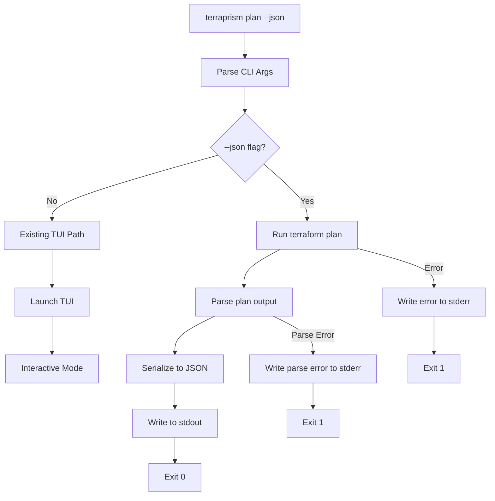

# Issue #10: Add --json Output Flag for Plan Command

**Author:** The Scribe  
**Date:** 2026-04-14  
**Status:** Proposal  
**Issue:** [#10](https://github.com/CaptShanks/terraprism/issues/10)

## Problem Statement

Currently, terraprism only outputs plan differences through its interactive TUI or print mode. Users need a machine-readable JSON output format for the `plan` command to enable integration with CI/CD pipelines, custom dashboards, and tools like `jq`. The requested `--json` flag should bypass the TUI entirely and output structured JSON containing resource changes with before/after values.

## Solution Design

Add `--json` flag support to the existing `plan` command in terraprism. When this flag is present, the application will parse the Terraform plan output using the existing parser package and serialize the resulting `Plan` struct to JSON format, then exit without launching the TUI.

The solution leverages terraprism's existing parser infrastructure (`internal/parser`) which already provides structured representation of plan data. This approach ensures consistency with the TUI's data model and reuses battle-tested parsing logic.

**Key Design Decisions:**
- Extend existing `runPlanMode` function rather than creating a separate command
- Reuse `parser.Plan` struct as the JSON schema to maintain consistency 
- Output raw JSON to stdout for pipeable integration
- Exit codes: 0 for success, 1 for parsing/execution errors
- No TUI launch when `--json` flag is detected

## Architecture Diagram



## Implementation Steps

1. **Modify argument parsing in `runPlanMode`**
   - Add `--json` flag detection in argument loop
   - Set boolean flag `jsonMode` when detected

2. **Add early exit path for JSON mode**
   - After successful plan parsing, check `jsonMode` flag
   - If true, serialize `plan` struct to JSON and output to stdout
   - Exit with code 0, bypassing TUI initialization

3. **Implement JSON serialization**
   - Add JSON struct tags to parser types (`Plan`, `Resource`, `Attribute`)
   - Create helper function to serialize plan with proper formatting
   - Handle potential JSON marshaling errors

4. **Update help text**
   - Add `--json` flag documentation to `printUsage()` function
   - Include example usage in help output

## File Changes

| File | Change Type | Description |
|------|-------------|-------------|
| `cmd/terraprism/main.go` | Modify | Add `--json` flag parsing and JSON output logic to `runPlanMode()` |
| `internal/parser/parser.go` | Modify | Add JSON struct tags to `Plan`, `Resource`, and `Attribute` types |
| `cmd/terraprism/main.go` | Modify | Update `printUsage()` to document `--json` flag |

## Interface Changes

### CLI Interface
**Before:**
```bash
terraprism plan [-- terraform-args]
```

**After:** 
```bash
terraprism plan [--json] [-- terraform-args]
```

### JSON Output Schema
```json
{
  "resources": [
    {
      "address": "aws_instance.web",
      "type": "aws_instance", 
      "name": "web",
      "action": "create",
      "attributes": [
        {
          "name": "instance_type",
          "old_value": "",
          "new_value": "t3.micro", 
          "action": "create",
          "computed": false,
          "sensitive": false
        }
      ],
      "raw_lines": ["# aws_instance.web will be created", "  + resource ..."]
    }
  ],
  "summary": "Plan: 1 to add, 0 to change, 0 to destroy",
  "total_add": 1,
  "total_change": 0, 
  "total_destroy": 0,
  "output_count": 0,
  "raw_plan": "..."
}
```

## Migration Strategy

This is an additive change with no breaking modifications:

1. **Phase 1:** Add JSON struct tags to parser types
2. **Phase 2:** Implement JSON mode in `runPlanMode` with flag parsing  
3. **Phase 3:** Update help text and documentation

**Rollback:** Simply revert commits - no data migrations or compatibility concerns.

## Testing Strategy

### Unit Tests
- Test JSON serialization of parser types in `internal/parser/parser_test.go`
- Verify JSON output matches expected schema for sample plan data
- Test argument parsing with `--json` flag combinations

### Integration Tests  
- Test end-to-end: `terraprism plan --json` produces valid JSON output
- Verify exit codes for success/error scenarios
- Test with various Terraform plan outputs (create, update, destroy, no-op)
- Validate JSON is valid and parseable by external tools

### Edge Cases
- Empty plans (no resources)
- Plans with only outputs
- Large plans with many resources
- Plans with sensitive attributes
- Error scenarios (invalid Terraform output, JSON marshaling failures)

## Risk Register

| Risk | Likelihood | Impact | Mitigation |
|------|------------|---------|------------|
| JSON schema changes break consumers | Low | High | Use semantic versioning, document schema stability |
| Performance impact on large plans | Medium | Low | Benchmark serialization, optimize if needed |
| Inconsistent data between TUI and JSON | Low | Medium | Use same parser.Plan struct for both paths |
| Flag conflicts with future features | Low | Low | Choose standard `--json` convention used by other tools |

## Open Questions

1. **Schema versioning:** Should JSON output include a schema version field for future compatibility?
   - **Recommendation:** Add `"schema_version": "1.0"` field for future-proofing

2. **Raw plan inclusion:** Should `raw_plan` field be optional to reduce output size?
   - **Recommendation:** Include by default, add `--json-compact` flag later if needed

3. **Error handling:** How should JSON mode handle partial parse failures?
   - **Recommendation:** Exit with error code 1 and JSON error object to stderr

## Definition of Done

- [ ] `terraprism plan --json` outputs valid JSON to stdout
- [ ] JSON includes all resource changes with before/after values  
- [ ] TUI is not launched when `--json` flag is used
- [ ] Exit code 0 for success, non-zero for errors
- [ ] Help text documents `--json` flag
- [ ] Unit tests cover JSON serialization
- [ ] Integration tests verify end-to-end functionality
- [ ] JSON output is valid and pipeable to `jq`