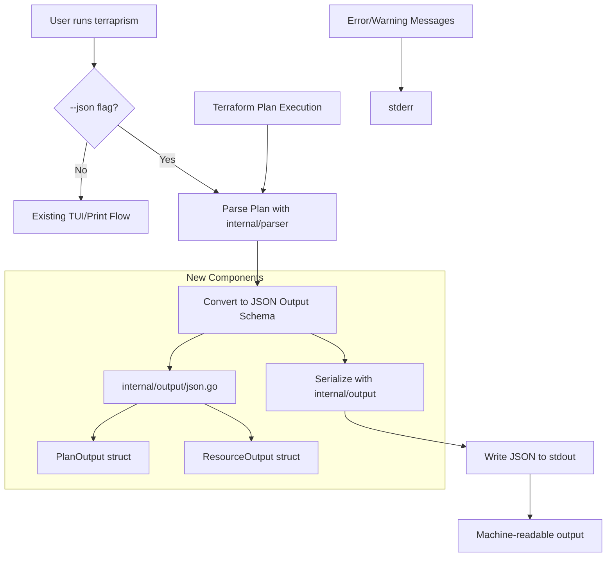

# Architecture Document: JSON Output Format

**Issue:** #14 - Add --json output format for machine-readable plan output  
**Date:** 2026-04-14  
**Author:** The Scribe  
**Status:** Proposal  

## Problem Statement

Currently, Terraprism only supports interactive TUI output and basic print mode (`--print`). Users need machine-readable JSON output for integration with CI/CD pipelines, automation scripts, and other tools that require structured data parsing.

The request is to add a `--json` flag that outputs Terraprism's parsed plan data in structured JSON format instead of the styled TUI, enabling programmatic consumption of Terraform plan analysis.

## Solution Design

Add a `--json` global flag that produces structured JSON output for `plan` and `apply` commands. When this flag is set, Terraprism will bypass the TUI completely and emit JSON to stdout while preserving stderr for errors and warnings.

The solution leverages the existing `internal/parser` package which already extracts structured plan data. A new `internal/output` package will handle JSON serialization with well-defined schemas.

**Key Design Principles:**
- **Minimal disruption:** Extend existing command flow, don't rewrite it
- **Schema stability:** Use explicit JSON tags for stable API contracts
- **Error separation:** JSON to stdout, operational messages to stderr
- **Backward compatibility:** Existing TUI and print modes remain unchanged

## Architecture Diagram



## Implementation Steps

1. **Create JSON output package**
   - Add `internal/output/` package
   - Define structured output types with JSON tags
   - Implement conversion from parser types to output types

2. **Add global flag parsing**
   - Modify main.go to recognize `--json` flag across all commands
   - Add flag parsing before command dispatch

3. **Integrate JSON output into command flow**
   - Modify `runPlanMode()` to check for JSON flag
   - Modify `runApplyMode()` to output JSON after plan phase
   - Skip TUI initialization when JSON flag is set

4. **Add tests and validation**
   - Unit tests for JSON serialization
   - Integration tests with real Terraform plan outputs
   - Verify `jq` compatibility

5. **Update CLI help and documentation**
   - Add `--json` to usage text
   - Document JSON schema structure

## File Changes

| File | Change Type | Purpose |
|------|-------------|---------|
| `cmd/terraprism/main.go` | Modify | Add JSON flag parsing and conditional output logic |
| `internal/output/json.go` | Create | JSON serialization logic and output types |
| `internal/output/doc.go` | Create | Package documentation |
| `internal/output/json_test.go` | Create | Unit tests for JSON output |
| `testdata/expected_output.json` | Create | Test fixtures for JSON validation |

## Interface Definitions

### JSON Output Schema

```go
// PlanOutput represents the complete JSON output structure
type PlanOutput struct {
    Summary   SummaryOutput    `json:"summary"`
    Resources []ResourceOutput `json:"resources"`
    Metadata  MetadataOutput   `json:"metadata"`
}

// SummaryOutput contains aggregate statistics
type SummaryOutput struct {
    Add     int `json:"add"`
    Change  int `json:"change"`
    Destroy int `json:"destroy"`
    Outputs int `json:"outputs"`
    Text    string `json:"text"`
}

// ResourceOutput represents a single resource change
type ResourceOutput struct {
    Address    string            `json:"address"`
    Type       string            `json:"type"`
    Name       string            `json:"name"`
    Action     string            `json:"action"`
    Attributes []AttributeOutput `json:"attributes"`
}

// AttributeOutput represents an attribute change
type AttributeOutput struct {
    Name      string `json:"name"`
    OldValue  string `json:"old_value,omitempty"`
    NewValue  string `json:"new_value,omitempty"`
    Action    string `json:"action"`
    Computed  bool   `json:"computed,omitempty"`
    Sensitive bool   `json:"sensitive,omitempty"`
}

// MetadataOutput contains execution metadata
type MetadataOutput struct {
    Version   string `json:"terraprism_version"`
    Timestamp string `json:"timestamp"`
    Command   string `json:"command"`
}
```

### CLI Flag Integration

```bash
# New JSON output examples
terraprism --json plan
terraprism --json apply -- -target=module.vpc
echo '...' | terraprism --json
```

## Data & Migration Plan

No data migration required. This is an additive feature that extends existing functionality without changing data storage or persistence patterns.

**Rollout Steps:**
1. Implement feature behind flag (no breaking changes)
2. Test with existing automation workflows
3. Document JSON schema for consumer integration
4. Deploy with feature announcement

**Rollback:** Simply remove the `--json` flag recognition; no data cleanup needed.

## Testing Strategy

### Unit Tests
- JSON serialization accuracy (`internal/output/json_test.go`)
- Schema validation with various plan types
- Error handling for malformed plan data

### Integration Tests
- End-to-end JSON output with real Terraform plans
- Flag combination testing (`--json` with other flags)
- Stderr vs stdout separation verification

### Validation Tests
- `jq` parsing compatibility
- JSON schema validation against real-world plans
- Performance impact measurement

### Test Data
- Use existing `testdata/*.json` Terraform plan files
- Add `testdata/expected_output.json` for output validation
- Test edge cases: empty plans, output-only changes, large plans

## Risk Register

| Risk | Impact | Likelihood | Mitigation |
|------|---------|------------|------------|
| **Breaking schema changes** | High | Low | Use explicit JSON tags, version metadata field |
| **Performance degradation** | Medium | Low | JSON serialization is lightweight vs TUI rendering |
| **Flag conflicts with terraform** | Medium | Low | Use `--` separator for terraform args |
| **Complex plan parsing edge cases** | Medium | Medium | Comprehensive test suite with real plan variations |
| **stdout/stderr contamination** | High | Low | Strict output discipline, existing print mode precedent |

## Risks & Mitigations

**Schema Evolution:** Include version field in metadata to support future schema changes without breaking existing consumers.

**Error Handling:** Preserve existing error handling patterns. JSON serialization errors go to stderr with non-zero exit codes.

**Performance:** JSON output is significantly faster than TUI rendering, so performance improvement is expected.

## Open Questions

- Should `--json` work with `history view` command? *(Recommended: Yes, for consistency)*
- Should we include raw terraform output in JSON? *(Recommended: No, focus on parsed structure)*
- Version the JSON schema immediately? *(Recommended: Yes, include schema version in metadata)*

## Checklist Handoff

- [ ] Create `internal/output` package with JSON types
- [ ] Add `--json` flag parsing in main.go before command dispatch  
- [ ] Modify `runPlanMode()` to output JSON when flag set
- [ ] Modify `runApplyMode()` to output JSON after plan phase
- [ ] Ensure JSON goes to stdout, errors to stderr
- [ ] Add comprehensive test coverage for JSON serialization
- [ ] Test `jq` compatibility with output
- [ ] Update CLI help text with `--json` flag
- [ ] Test flag combinations and edge cases
- [ ] Verify no TUI initialization when JSON flag active

## Appendix: Discovery Notes

**Key Files Examined:**
- `cmd/terraprism/main.go` - Main command dispatch and flag handling
- `internal/parser/parser.go` - Plan parsing and structured types
- `internal/tui/` - TUI implementation (to understand bypass requirements)

**Existing Patterns:**
- Global flags parsed before command dispatch (lines 47-79)
- Print mode precedent (`printMode` variable, `--print` flag)
- Structured data already available from parser package
- Clear separation of stdout/stderr in existing print mode

**Architecture Decision:**
Chose to extend existing command flow rather than create new JSON subcommands. This approach maintains consistency with the `--print` flag pattern and requires minimal code changes while providing maximum flexibility for users.