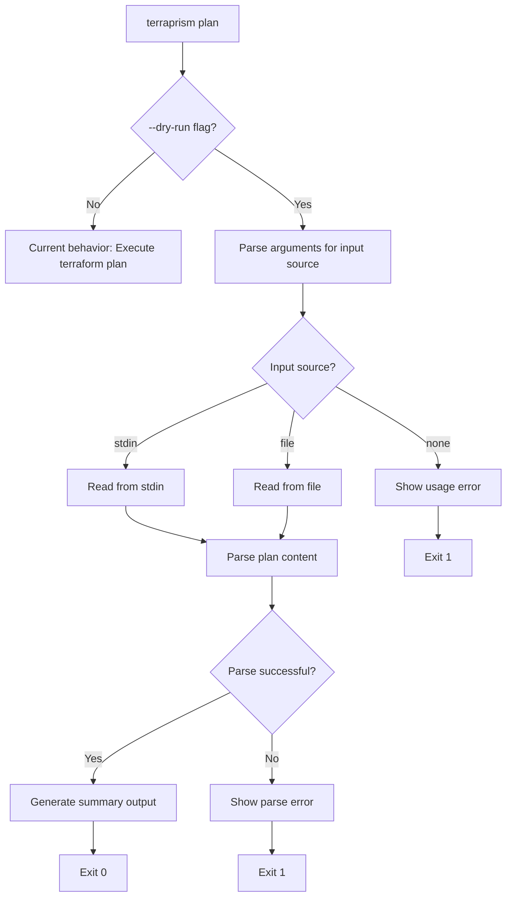

# Issue #4: Add --dry-run flag to plan command

**Date:** 2026-04-14  
**Author:** The Scribe  
**Status:** Proposal  
**Issue:** [#4](https://github.com/CaptShanks/terraprism/issues/4)

## Problem Statement

Add a `--dry-run` flag to the `plan` command that allows validation of Terraform plan syntax without executing terraform/tofu commands or requiring provider credentials. This addresses the need for CI pipelines to validate plan files without making provider API calls.

**Current behavior:** `terraprism plan` executes `terraform plan` command and displays results in TUI
**Desired behavior:** `terraprism plan --dry-run` reads plan content from stdin/file and displays summary without provider execution

## Solution Design

The solution adds a `--dry-run` flag to the existing `plan` command that switches from execution mode to parsing-only mode. When dry-run is enabled, terraprism will read plan content from stdin or a specified file, parse it using the existing parser, and output a text summary.

**Key design decisions:**
- Reuse existing parser infrastructure (`internal/parser`) for consistency 
- Follow existing flag parsing patterns in `main.go`
- Output simple text format (not TUI) for CI pipeline compatibility
- Handle all edge cases: empty plans, malformed content, missing files

## Implementation Steps

1. **Modify argument parsing in `runPlanMode`**
   - Add `--dry-run` flag detection
   - Extract input file handling logic

2. **Create dry-run execution path**
   - Implement `runPlanDryRun()` function
   - Handle stdin vs file input
   - Generate summary output

3. **Add summary output formatter**
   - Create `formatPlanSummary()` helper
   - Display add/change/destroy counts
   - Handle empty plans gracefully

4. **Update help text**
   - Add `--dry-run` to plan command usage
   - Document expected input format

5. **Add error handling**
   - Invalid plan files
   - Missing input files
   - Malformed content

## File Changes

| File | Change Type | Description |
|------|-------------|-------------|
| `cmd/terraprism/main.go` | Modify | Add `--dry-run` flag parsing in `runPlanMode()` |
| `cmd/terraprism/main.go` | Add | New `runPlanDryRun()` function |
| `cmd/terraprism/main.go` | Add | New `formatPlanSummary()` helper function |
| `cmd/terraprism/main.go` | Modify | Update `printUsage()` to document new flag |

## Testing Strategy

**Unit Tests:**
- Test dry-run flag parsing with various argument combinations
- Test summary formatting with different plan scenarios (empty, normal, large)
- Test error handling for malformed plan content

**Integration Tests:**
- Test with real terraform plan output from `testdata/` directory
- Test stdin input: `cat testdata/plan.out | terraprism plan --dry-run`
- Test file input: `terraprism plan --dry-run testdata/plan.out`

**Edge Cases:**
- Empty plan (no changes)
- Malformed HCL content
- Missing input file
- Binary plan files (should error gracefully)
- Very large plan files

**Test Data Requirements:**
- Valid plan output with resources to add/change/destroy
- Empty plan output (no changes)
- Malformed plan content
- Plans with outputs only

## Risk Register

| Risk | Impact | Likelihood | Mitigation |
|------|--------|------------|-------------|
| Flag conflicts with existing terraform args | Medium | Low | Use distinctive flag name, document clearly |
| Parser fails on edge case plans | Medium | Medium | Comprehensive test coverage, graceful error handling |
| Performance with large plan files | Low | Low | Stream processing if needed |
| Breaking change to existing behavior | High | Low | Additive flag only, no default behavior change |

## Open Questions

None - all requirements clarified by maintainer in issue comments.

## Appendix: Discovery Notes

**Key files explored:**
- `cmd/terraprism/main.go`: Main entry point, argument parsing, command dispatch
- `internal/parser/parser.go`: Plan parsing logic, already extracts summary counts
- Pattern: Other commands use simple flag parsing with for loops

**Existing patterns found:**
- Flag parsing: Manual loop checking `args[i]` (lines 242-253 in `runPlanMode`)
- Input handling: `runViewMode` already handles stdin vs file input (lines 697-713)
- Error handling: Consistent `fmt.Fprintf(os.Stderr, ...)` + `os.Exit(1)` pattern

**Surprises:**
- Parser already extracts exact data needed (`TotalAdd`, `TotalChange`, `TotalDestroy`)
- View mode already has stdin handling logic that can be reused
- No complex argument parsing library - keeping it simple and consistent